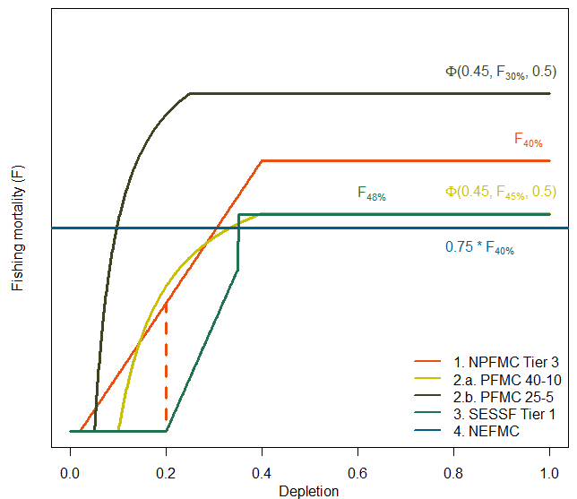
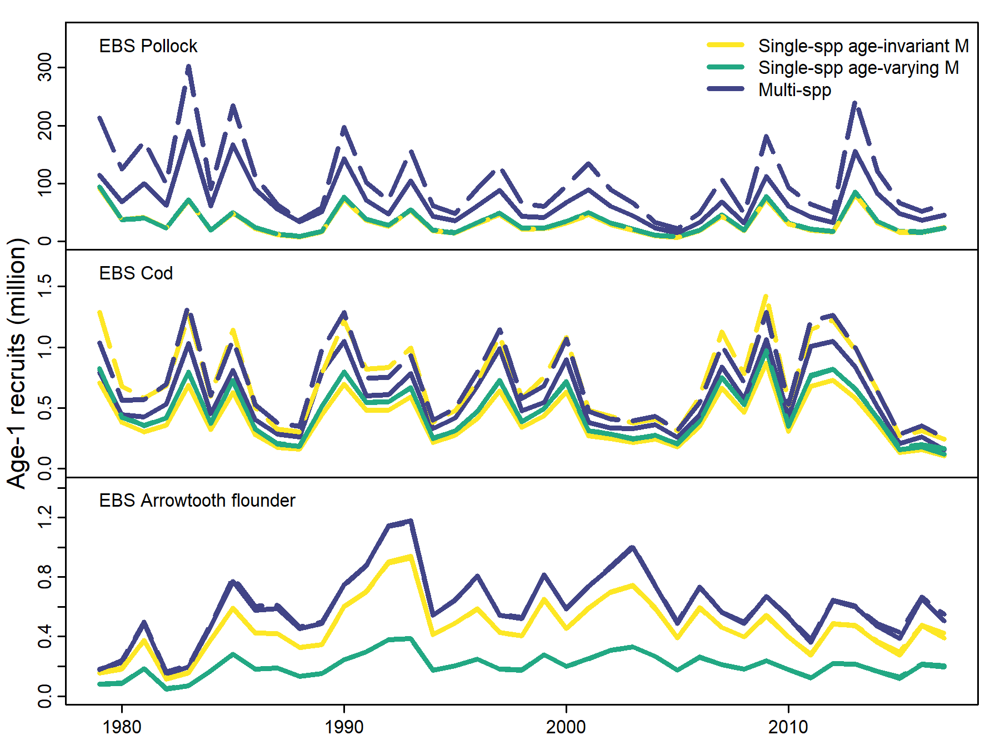

<!--
============================================================================
RENDER:  quarto render Rceattle-status-roadmap.qmd
OUTPUT:  Rceattle-status-roadmap.pptx (16:9, pandoc default layout)
FIGURES: all embedded figures live in ./figures/ (real Rceattle outputs
         copied from the Rceattle ecosystem research projects).
LAYOUT:  pandoc's pptx writer gives each slide ONE content region (or a
         two-column pair). Every slide below holds exactly one block —
         a list, a table, a single image, or one columns div with one
         block per column — so nothing overflows onto a blank slide.
SOURCES: content cross-checked against the Rceattle package (v4.3.1
         vignettes + man pages), the AFSC 2026 Groundfish Stock
         Assessment Guidelines, and Grant's WGSAM 2025 / ICES MGWG 2025
         Rceattle overview decks.
NOTES:   Target length ~35 min. Speaker notes (::: {.notes}) carry the
         depth so the slides stay concise and visual. Items in [brackets]
         are placeholders for Grant to verify or complete.
============================================================================
-->

```{r setup, include=FALSE}
knitr::opts_chunk$set(
  echo = TRUE,
  warning = FALSE,
  message = FALSE,
  fig.width = 4.5,
  fig.height = 4,
  dpi = 150,
  out.width = "100%"
)
library(Rceattle)
```

## Today

- **What Rceattle is** — one tool, two jobs
- **Workflow integration** — bridging existing assessments in
- **MSE & harvest control rules** — plug-and-play
- **Operational readiness** — the diagnostics checklist
- **Rceattle in practice** — where it is already used
- **Research power** — biology and environment
- **Roadmap** — where we go next

::: {.notes}
Set the frame for the next ~35 minutes. Budget roughly: intro 4 min;
workflow + MSE 8 min; operational readiness + diagnostics 8 min;
applications 4 min; research power 5 min; user experience 4 min;
roadmap 2 min; conclusion and discussion 2 min plus open Q&A.

The single message I want to land today: Rceattle is **not** a research
prototype that we hope to operational someday, and it is **not** an
operational black box that is hard to do science with. It is one codebase
deliberately built so that the same fitted model serves both jobs. Every
section that follows is evidence for that claim — the operational
readiness section maps directly onto our own AFSC stock assessment
guidelines, and the applications section shows assessments that are
already running in Rceattle today.
:::

## Introduction to Rceattle

- State-space, age/sex/species-structured modelling with TMB
- One framework: single species → full multispecies predation
- Flexible in species, sexes, fleets, ages
- Empirical weight-at-age AND internal growth estimation
- Priors and environmental linkages on q, R, M, and Growth
- **Two focal areas:**
  - *Research* — climate linkages, predation, random effects, MSE
  - *Operational* — diagnostics, retrospectives, projections, advice
- [Vignettes and examples](https://grantdadams.github.io/Rceattle/index.html)

[Comparison spreadsheet](https://docs.google.com/spreadsheets/d/1ZGw3VSLFGaYIBSkkKE_yszu2uasGC7q8l0-3GkQgIL0/edit?gid=1430605854#gid=1430605854)

::: {.notes}
It has since been enhanced by Sophia Wasserman,
Raquel Ruiz Diaz, Cole Monnahan, Jane Sullivan and Kalei Shotwell. So it
is already a shared AFSC tool with a track record, not a one-person
prototype.

Why emphasise "dual purpose"? In most groups the research model and the
operational model drift into two separate codebases, and every cycle
someone pays the cost of porting ideas between them — that translation
step is where errors and delays live. Rceattle removes that gap: the
fitted object you used to test a climate hypothesis is literally the
same object — same class, same diagnostics, same projection machinery —
that you take to the November Plan Team.

Under the hood, TMB gives us speed (so retrospectives, jitter and MSE
are cheap) and uncertainty (`sdreport` delivers standard errors and a
covariance matrix for free). The figure is a real Rceattle output —
Age-1+ biomass for EBS pollock, cod and arrowtooth flounder under
single-species and multispecies configurations, all from one fitted
model list.
:::

## Existing `Rceattle` models ([GitHub](https://github.com/grantdadams/Rceattle-models))

**Very Close or Exact**
- EBS: pollock, northern rock sole, yellowfin sole, arrowtooth flounder, atka mackerel
- GOA:  pollock, arrowtooth flounder, northern rockfish
- PFMC: Hake

**Approximation**
- EBS Alaska plaice 
- EBS cod (in progress)
- Sablefish (time-varying ALK)
- GOA cod (in progress)
- GOA pop (hasn't been a priority)


## Workflow (data)

::: {.columns}

::: {.column width="50%"}
**Modelling cycle**

Data → Fit → Diagnose → Project → Harvest advice → MSE test

- Data via **Excel template** *or* a programmatic R list
- Outputs map straight onto **SAFE tables and figures**
- Integrated projections and diagnostics

:::

::: {.column width="50%"}
```{r}
pk_data <- read_data("Data/Pollock_2023.xlsx")
pk_data$fleet_control$proj_F_prop <- 1
plot_data(pk_data, subplots = 2)
```
:::

:::

::: {.notes}
This slide answers "how does Rceattle fit into how we already work?"
The honest concern when anyone proposes a new platform is disruption —
nobody wants to throw away a model that the SSC has accepted.

Rceattle's answer is bridging. Our own 2026 AFSC Groundfish Stock
Assessment Guidelines (Section 4.8) require that, when an assessment
transitions software, the author present a side-by-side comparison of
data likelihood components and parameter estimates with the percent
differences. Rceattle is built for exactly that step: there is a
Stock Synthesis-to-Rceattle conversion vignette, and the figure shows
the GOA CEATTLE example reproducing the 2018 SAFE assessment — the
coloured lines are progressively longer bridge stages, the dark line is
the accepted SAFE model. You demonstrate equivalence first, then extend.

That bridging discipline is not theoretical — Rceattle already
reproduces a long list of accepted EBS and GOA assessments closely or
exactly, which we will see on the applications slide. The adoption path
is therefore not "abandon your model": it is bridge the current
assessment in, confirm it reproduces the accepted results, and only then
take advantage of the extra capability. Data entry stays familiar — the
Excel template means data prep does not require deep R skills — and
because outputs come back as tidy quantities with uncertainty, dropping
them into the SAFE document is straightforward.
:::


## Model fitting

::: {.columns}

::: {.column width="50%"}
**Controls on estimation**

- Standard `nlminb` optimization controls
- TMB based phasing
- Integrated convergence documentation
- Roxygen helpers for options `?fit_mod`

:::

::: {.column width="50%"}
```{r, results='hide'}
pk_model <- fit_mod(
  data_list = pk_data,
  estimateMode = 0,
  initMode = "Equilibrium",
  fit_control = fit_control(phase = TRUE,
                            verbose = 0))
```
:::

:::

## Workflow & Output

**The fitted model is a first-class R object — class `Rceattle`:**

```{r, warning=FALSE, message=FALSE, eval = FALSE}
summary(pk_model)       # compact summary
AIC(pk_model)           # logLik() with df — just works
vcov(pk_model)          # parameter covariance (sdreport)
residuals(pk_model)     # tidy residuals across data
as.data.frame(pk_model) # derived quantities as a frame
plot(fit, what = "ssb") # plot dispatcher
```

- `plot_data()` for inputs; **~30 `plot_*` functions**, list-aware
- `fit_mod()` builds parameter & map objects automatically

::: {.notes}
The biggest barrier to a team adopting any new assessment tool is not the
statistics — it is the learning curve and the friction of getting
results back out. This slide is the answer to "what is it like to
actually use?"

Rceattle deliberately makes the fitted model behave like any native R
model object. It has a full S3 method ecosystem: `print()` and
`summary()` give you a compact view; `coef()`, `logLik()` and therefore
`AIC()` work; `vcov()` returns the parameter covariance from the TMB
`sdreport`; `residuals()` returns tidy residuals across indices and
composition data; `as.data.frame()` hands back derived quantities as a
plain data frame; and `plot()` is a dispatcher — `plot(fit, what =
"ssb")`. The practical consequence: anyone on the team who already knows
how to interrogate an `lm()` fit already knows how to interrogate an
Rceattle fit. There is no new mental model.

On top of that there are about thirty `plot_*` functions — biomass, SSB,
recruitment, catch, F, selectivity, mortality, index and composition
fits, stock-recruit, depletion, biomass-eaten — and they accept *lists*
of models, so a model-comparison plot is one line. Those comparison
plots are themselves diagnostics. `plot_data()` visualises the inputs
before you ever fit. And `fit_mod()` builds the parameter and map
objects automatically from a handful of switches, so the analyst
specifies *what* model they want, not the bookkeeping.

The on-ramp is gentle: data can come in through the bundled Excel
template, so data prep does not require R fluency; every function has
`?` help; there are eleven vignettes covering each workflow; an examples
folder with runnable scripts; an on-boarding guide; and a package
website. The argument to the team is simply: the adoption cost is low
enough that you can actually use this, and the tidy outputs drop
straight into SAFE tables and figures with reproducible code.
:::


## Diagnostics

| AFSC 2026 SAFE guideline (§4.9) / Diagnostics WG | In Rceattle |
|---|---|
| Converged: invertible Hessian, max gradient < 1e-5 | `fit_mod()` + Newton steps (`fit_control()`) |
| Evidence of the global minimum — **jitter analysis** | **`jitter()` — built in** |
| All parameters estimated within bounds | `build_bounds()`; bounds reported on the fit |
| **≥10-year retrospective + Mohn's rho** | **`retrospective()` — built in** |
| Historical (between-model) retrospective | List-aware `plot_biomass()` |
| Sensitivity to model specification | Refit configurations; comparison plots |
| Quantities, fits & parameters reported with uncertainty | TMB `sdreport`; `vcov()`, `residuals()`, `as.data.frame()` |
| Reproducible inputs, versioned model files | Excel / R data objects; pinned release tag |

::: {.notes}
This slide is the heart of the "is it operational?" question, and I have
deliberately built the checklist from documents the team already owns —
not from a Rceattle wish list.

The April 2026 AFSC Groundfish Stock Assessment Guidelines, Section 4.9
(Convergence Status and Criteria, Likelihood Profiles, Retrospective
Analysis, Historical Retrospectives, Sensitivity to Model
Specification), together with the Diagnostics Working Group draft, define
what an assessment must demonstrate to be accepted as Best Scientific
Information Available. That is the bar. The left column of this table is
that bar, paraphrased; the right column is the Rceattle function that
clears it.

The key point: these are first-class functions in the package, not
bolt-on scripts each analyst rewrites. Convergence is checked at fit
time, with optional Newton steps through the inverse Hessian to drive the
maximum gradient down — the guidelines specifically endorse that as
stronger evidence than a gradient threshold alone. One design choice
worth flagging: Rceattle deliberately keeps parameter bounds light,
because a parameter estimated hard against a bound is itself a signal of
a poorly specified model — so jitter, not bound-clamping, is how we
confirm the optimum. Likelihood profiles are produced by phasing and
refitting.

For assessments that need Bayesian advice, the fitted object's TMB
`obj` plugs straight into `tmbstan` for MCMC — so the Rhat and effective
sample size diagnostics the guidelines ask for (Rhat < 1.01, ESS > 400)
are available today, not a future feature.

Frame it for the audience this way: when you bring an Rceattle
assessment to the Plan Team, every row of the table the reviewers expect
is something the package produced for you, the same way every time.

[If the team has a separate internal "operational model requirements"
checklist beyond the SAFE guidelines, confirm each item is represented
here and add any that are missing.]
:::

## Diagnostics — Jitter & Retrospective

::: {.columns}

::: {.column width="50%"}
**`retrospective()`** — peels years, refits, returns Mohn's rho
*and* forecast-skill in one call

**`jitter()`** — refits from many perturbed starts

- One line each; list-aware plotting
:::

::: {.column width="50%"}
```{r, results='hide'}
# jitters <- jitter(pk_model, njitter = 10, sd = 0.2)
retros <- retrospective(pk_model, peels = 5)
plot_biomass(retros$Rceattle_list)
# retros$mohns # Get Mohn's rho
```
:::

:::

::: {.notes}
Spend a minute on *why* these two diagnostics are the proof of
operational rigour, not just nice-to-haves.

Retrospective analysis re-fits the model after iteratively removing the
most recent years of data. If the model's perception of stock status
shifts systematically as data accrue — a retrospective pattern — that
bias flows straight into harvest advice. Mohn's rho summarises it;
values outside roughly ±0.2 for spawning biomass are a flag worth
investigating, and the guidelines require at least a 10-year
retrospective. Rceattle's `retrospective()` does the peels, refits, and
returns Mohn's rho — and, via `nyrs_forecast`, also returns a
forecast-skill rho, so you quantify not just terminal-year bias but how
reliable the projection is. The figure is a real multispecies
retrospective: rho is printed per species, and notice the arrowtooth
flounder SSB rho of 0.48 — the tool surfaces the problem rather than
hiding it, which is exactly what a reviewer wants.

Jitter testing re-fits the model from many randomly perturbed starting
values. The guidelines explicitly ask for "evidence of search for global
best estimates" — jitter is that evidence. If every jittered run returns
the same minimum negative log-likelihood, you have strong support that
the optimiser found the global minimum. A spread of NLL values means
multiple local minima and fragile inference. `jitter()` runs this in one
call; non-converging runs are dropped, so a small surviving count is
itself a warning.

The bottom line for the team: because both are one function call, there
is no friction excuse to skip them — and the reviewer gets the figure
they expect, in a familiar form, every cycle. [Replace the bracketed
placeholder with a rendered jitter NLL-spread histogram from a real
stock before presenting.]
:::

## Diagnostics — Model summaries and plots

::: {.columns}

::: {.column width="50%"}

S3 class methods to extract key quantities

- `coef()`, `logLik()`, `AIC()`, `vcov()`, `residuals()`

Custom profiling can be easily set up via TMB's map argument

Diagnostic plots

- `plot_comp()`, `plot_index()`, `plot_indexresidual()`, `plot_catch()`
  
Linked to `asaR` in development

:::

::: {.column width="50%"}
```{r}
knitr::kable(head(as.data.frame(pk_model)), format = "pipe", digits = 3)
```
:::

:::


## MSE & Harvest Control Rules — Plug-and-Play

::: {.columns}

::: {.column width="50%"}
- **Every fitted model is already an operating model and estimation model** — no
  re-coding
- `run_mse(om, em, ...)` closes the loop: simulate → sample →
  re-assess → apply HCR
- **Flexible HCR selection** via `build_hcr()`:
  NPFMC Tier 3, PFMC Category 1, SESSF Tier 1, constant-F / SPR,
  CMSY
- **Flexible BRP**:
  SPR, depletion, MSY & dynamic-B0 reference points; single- or
  multispecies
:::

::: {.column width="50%"}
{width=4.7in}

:::

:::

::: {.notes}
This is one of the strongest arguments for the platform, so spend time
here.

"MSE plug-and-play" means: in most workflows, building a management
strategy evaluation is a separate project — you re-implement the
assessment as a simulation operating model, which can take weeks and
introduces a whole new class of bug, the OM/EM mismatch. In Rceattle the
operating model *is* your fitted assessment, and the estimation model is
just another `fit_mod()` call with a harvest control rule attached.
`run_mse()` will accept *any* Rceattle model as the OM or the EM. A
single call then closes the loop: it simulates data forward, samples
surveys and the fishery on whatever schedule you specify, re-assesses on
the assessment interval, applies the HCR, and repeats. That collapses
weeks of bespoke coding into one function and removes the OM/EM-mismatch
error entirely.

"Flexible HCR selection" matters because the questions the SSC and Plan
Team ask are policy questions: what happens under a different control
rule, a different biomass limit, a longer survey interval? `build_hcr()`
ships the rules already implemented — the NPFMC Tier 3 rule we actually
use, the PFMC 40-10 and 25-5 rules, the Australian SESSF rule,
constant-F and constant-SPR, CMSY — and because the rule is defined by
its shape, any target or limit reference point can be specified: SPR,
depletion, dynamic B0, multispecies B0, MSY. You can switch with one
argument and test the management rule that governs the stock against
credible alternatives, on the same stock, in an afternoon.

Reproducibility: `run_mse()` uses explicit seed plumbing — each
simulation worker is seeded as `seed + sim` on a clean parallel cluster,
so re-running with the same seed reproduces every trajectory exactly.
For management-facing runs, save the seed and `packageVersion("Rceattle")`
with the results so a reviewer can reproduce them exactly.
:::

## Closed-Loop MSE in Action

::: {.columns}

::: {.column width="60%"}
```{r, results='hide'}
pk_data$fleet_control$proj_F_prop <- 1
em_model <- fit_mod(
  data_list = pk_data,
  estimateMode = 0,
  initMode = "Equilibrium",
  HCR = build_hcr(HCR = "NPFMC",
                  Ftarget = 0.4, # F40% - SPR
                  Flimit  = 0.35, # F35% - SPR
                  Plimit  = 0.2,  # No fishing when SB<SB20
                  Alpha   = 0.05),
  fit_control = fit_control(phase = TRUE,
                            verbose = 0))

mse1 <- run_mse(
  om = pk_model, em = em_model,
  nsim = 10,
  assessment_period = 2,
  # 8 fleets with different sampling
  sampling_period = c(1, 2, 1, 2, 2, 2, 1, 1)
)
```
:::

::: {.column width="40%"}

```{r}
# summ <- mse_summary(mse1)
plot_depletionSSB(list(mse1$Sim_1$OM,
                       mse1$Sim_1$OM_no_F),
                  model_names = c("Tier3", "No F"))
```

:::

:::

::: {.notes}
This is what the closed loop produces. The left column is the operating
model — the simulated "truth" — and the right column is the estimation
model's perception of that truth after repeatedly re-assessing and
applying the harvest control rule. The three rows are different
assumptions about natural mortality: single-species age-invariant M,
single-species age-varying M, and the full multispecies model where M
emerges from predation.

The point to make: because the operating model and the estimation model
are both ordinary Rceattle fits, producing this entire grid is a handful
of `run_mse()` calls, not a separate simulation project. You can ask "how
well does our Tier 3 rule perform if natural mortality is really
age-varying, or really driven by predation?" and get a defensible,
reproducible answer. That is the practical payoff of MSE plug-and-play —
it turns management-strategy questions from multi-week efforts into
routine analyses the team can run every cycle. It is also how we build
the evidence base the Council will want before it leans on multispecies
harvest advice.
:::


## Rceattle applications

::: {.columns}

::: {.column width="54%"}
**Operational**

- **GOA arrowtooth flounder** — 2025 SAFE produced & bridged in Rceattle
- **GOA multispecies assessment** — run annually since 2019 for ESP/ESR; standalone
  assessment document begins 2026

**Research**

- Pacific hake cannibalism; hake + arrowtooth (+ Steller sea lion)
  multispecies; Bering Sea multispecies assessment
- DSEM + AFSC stock research

*Adams, Holsman, Wasserman, Ruiz Diaz, Monnahan, Sullivan, Shotwell, Ferriss.*
:::

::: {.column width="46%"}
{width=4.4in}
:::

:::

::: {.notes}
This slide is the empirical answer to "is this real, or is it a promise?"

On the operational side: the GOA arrowtooth flounder 2025 SAFE
assessment was produced and bridged in Rceattle — a real assessment,
through the real review process. The GOA multispecies assessment has run
annually since 2019; it already feeds time-varying natural mortality and
biomass-eaten indices into the ecosystem status reports, and it is being
written up as a standalone assessment document for the Council in
2025/2026, providing alternative biological reference points and helping
contextualise risk. And, as mentioned earlier, Rceattle reproduces a
substantial list of accepted EBS and GOA assessments closely or exactly
— pollock, rock sole, yellowfin sole, arrowtooth, northern rockfish —
with a handful more (Alaska plaice, EBS and GOA cod, sablefish, Atka
mackerel) at the approximation stage pending specific features like
conditional age-at-length. That replication record is the concrete proof
that "operational" is a description, not an aspiration.

On the research side: the Pacific hake work uses Rceattle to quantify
how time-varying predation and cannibalism bias population estimates;
the hake + arrowtooth and hake + arrowtooth + Steller sea lion models
push the multispecies capability; and the Bering Sea multispecies
assessment is the long-running application the GOA model was built to
follow.

Close on the contributor line: this is a multi-contributor AFSC effort.
That matters for adoption — when the team adopts Rceattle they are not
betting on one person, they are joining a tool several colleagues
already build on and maintain.
:::

## Research Flexibility

::: {.columns}

::: {.column width="52%"}
- **Estimable growth** — von Bertalanffy & Richards, or empirical
  weight-at-age (`build_growth()`)
- **State-space random effects** — on recruitment, M, catchability &
  selectivity (AR1, IID, 2D-AR1, random walk)
- **Flexible priors** — normal, lognormal, gamma, beta — on any
  parameter *or* linkage coefficient
- **Environmental linkages**, formula-driven (`linkage_spec()`) — on
  **recruitment** (R0, alpha, beta), **natural mortality** (M1),
  **growth** (K, Linf, L1)
- **Bioenergetics predation** → time- & age-varying M (multispecies)
:::

::: {.column width="48%"}
```{r, warning=FALSE, message=FALSE, eval = FALSE}
pk_climate_model <- fit_mod(
  data_list = pk_data,
  estimateMode = 0, 
  initMode = "Equilibrium",
  M1Fun = build_M1(
    M1_model = "sex_age_invariant",
    linkages = list(
      M1 = linkage_spec(
        formula = ~ 1 + BTempC
        ))),
  recFun = build_srr(srr_fun = "Ricker",
                     linkages = list(
      alpha = linkage_spec(
        formula = ~ 1 + poly(BTempC, 3),
        priors = list(
         "(Intercept)" = lognormal(0.3, 0.05)
        )))),
  fit_control = fit_control(phase = TRUE,
                            verbose = 0))

```
:::

:::

::: {.notes}
This is the "research" half of the dual purpose — and the point I most
want to land is that it runs in the *same object* you would bring to the
Plan Team.

Why does this flexibility matter? Classic assessments assume
stationarity — recruitment, natural mortality and growth are constant,
or vary randomly around a fixed mean. Under a changing climate that
assumption is increasingly hard to defend, and our own AFSC working
groups — the recruitment working group and the time-varying-parameters
working group — are explicitly pushing assessments to represent
non-stationarity.

Rceattle gives you two complementary tools for that. First, state-space
random effects: recruitment, natural mortality, catchability and
selectivity can all be estimated as random effects — AR1, IID, 2D-AR1
across age and year, or a random walk — so a parameter can vary through
time in a statistically principled way rather than being forced
constant. Second, the environmental linkage system: a long-format
"linkage table" where each row is one estimated coefficient tying an
environmental driver to a process parameter, specified with ordinary R
formulas through `linkage_spec()` — no editing of the TMB template. You
can put bottom temperature, SST, a climate index, or zooplankton biomass
onto recruitment, onto natural mortality, or onto von Bertalanffy growth
parameters, with interactions, polynomials, and effects that vary by
species, sex or age. A covariate hypothesis can be specified, fitted,
AIC-compared, and carried into projections and reference points in an
afternoon.

Flexible priors let you bring external information in formally and
document it — the natural mortality prior the guidelines recommend, or a
meta-analytic value — using a normal, lognormal, gamma or beta family.
And in multispecies mode, predation is modelled with bioenergetics, so M
becomes time- and age-varying as a function of predator abundance and
temperature.

One emerging capability worth flagging: a development branch adds
Dynamic Structural Equation Models for recruitment, so the
environment-to-recruitment relationship can be specified as an explicit
causal graph. The figure shows ROMS-projected drivers under low / medium
/ high SSP scenarios — exactly the covariates a linkage consumes.
:::


## DSEM integration

::: {.columns}

::: {.column width="52%"}
- DSEM linked to recruitment
- Can link species together via DSEM
- Linkages to growth and M in dev

:::

::: {.column width="48%"}
```{r, warning=FALSE, message=FALSE, eval = FALSE}
sem_iid = "
  # link, lag, param_name, start_value
  ScaledBT -> ScaledBT, 1, AR_BT, 0
  ScaledBT -> recdevs1, 1, BT_to_R, 0
  recdevs1 <-> recdevs1, 0, sigmaR1, 1
"

dsem_model <- fit_mod(
  data_list = pk_data,
  estimateMode = 0, 
  initMode = "Equilibrium",
  dsem = build_DSEM(
    sem = sem_iid,
    family = "normal"
  ),
  random_rec = TRUE, # Random recruitment
  fit_control = fit_control(phase = TRUE,
                            verbose = 0))
```
:::

:::

## Development Roadmap

::: {.columns}

::: {.column width="50%"}
**Short-term** *(next 1–2 releases)*

- Repository clean-up & standardisation
- Priors and environmental linkage on observation model
- **OSA residuals** — to match the 2026 SAFE guidelines
- Further DSEM integration (growth, M, MSE)
:::

::: {.column width="50%"}
**Longer-term**

- Predation: uncertainty in functional form & suitability;
  bottom-up forcing
- **Routine MSE testing** to underpin harvest advice
- MSE-based alternatives to multispecies/dynamic reference points

:::

:::

::: {.notes}
These items are drawn from my own "next steps" lists, but the team
should help rank them.

Short-term, the work is mostly consolidation and guideline alignment:
cleaning and standardising the repository, expanding the self-testing
and simulation-testing suite, and adding one-step-ahead (OSA) residuals.
OSA matters specifically because the 2026 SAFE guidelines now ask for OSA
residuals and the SDNR statistic for composition fits; Rceattle
currently returns Pearson residuals, so adding OSA keeps us
guideline-current. Conditional age-at-length support and internal growth
estimation are the other active threads — they are what stand between
the "approximation" assessments and exact replication. A CRAN release is
also in motion.

Longer-term, the agenda is mostly about multispecies credibility. The
functional form of predation, and of prey suitability, carries real
uncertainty; bottom-up forcing is not yet represented; and diet data
themselves are uncertain. The strategic item is routine MSE testing: the
Council is currently reticent to lean on multispecies harvest advice,
and the way you earn that confidence is by MSE-testing the multispecies
models against single-species management — which is exactly what
Rceattle's plug-and-play MSE makes feasible. A related idea is to use
MSE results, rather than multispecies biological reference points, as
the basis for advice.

Action for the audience: replace the bracketed line with the agreed
prioritised list, owners and target quarters. I especially want input on
ordering — which item would most increase your confidence in using
Rceattle for a November assessment.
:::

## Conclusion & Q&A

**Take-home messages**

- **One platform, two jobs** — research exploration and operational
  advice share a single codebase and a single fitted object
- **Already in operational use** — GOA ATF 2025 SAFE; GOA multispecies
  assessment; many accepted assessments reproduced
- **MSE is plug-and-play**; harvest control rules are swappable
- **Diagnostics meet the operational guidelines** out of the box —
  jitter and retrospective are one call each
- **Low adoption cost** — familiar R idioms, bridges in from existing
  models, a multi-contributor AFSC tool

::: {.notes}
Close by restating the thesis: Rceattle is one codebase that does the
research job and the operational job, because the same fitted object
serves both. That is not a slogan — each section today was evidence:
bridging shows it slots into our existing workflow; MSE plug-and-play and
swappable HCRs show the policy-testing capability; the operational
checklist shows it meets our own SAFE guidelines; the applications slide
shows assessments already running in it, including a 2025 SAFE; the
linkage system, random effects and flexible priors show genuine research
depth; and the S3 ecosystem shows the adoption cost is low.

Then open the discussion. The two prompts are deliberate. The first —
which stock to bridge in next — turns the talk into a concrete next step
rather than an abstract endorsement; a good pilot is a stock with a
relatively simple, well-behaved assessment so the bridge is clean. The
second — what would make you confident for a November assessment —
surfaces the real blockers early, while there is still roadmap time to
address them.

Contact and resources for follow-up: grant.adams@noaa.gov; bug reports
and feature requests as GitHub issues so the discussion is publicly
searchable; the package website, the eleven vignettes, the on-boarding
guide, and the GOA ATF 2025 SAFE and bridging documentation for anyone
who wants to try it before the next meeting. Offer to sit down with
anyone who wants to bridge their stock in.
:::
