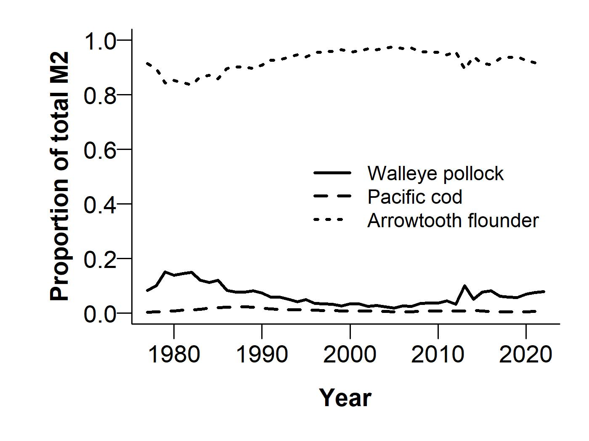

---
output:
  word_document:
    fig_width: 4
    keep_md: yes
  html_document: default
  header-includes:
  - \usepackage{inputenc}
  - \usepackage{unicode-math}
  pdf_document:
    keep_tex: yes
    latex_engine: xelatex
---

## Multispecies model estimates of time-varying natural mortality in the GOA
*Grant Adams$^1$, Kirstin K. Holsman$^{1,2}$, Steve Barbeaux$^2$, Martin Dorn$^2$, Pete Hulson$^3$, Jim Ianelli$^2$, Cole Monnahan$^2$, Kalei Shotwell$^2$, Ingrid Spies$^2$, Ian Stewart$^4$, and Andre Punt$^1$*

adamsgd@uw.gov

$^1$School of Aquatic and Fishery Sciences, University of Washington, Seattle, WA, USA

$^2$Resource Ecology and Fisheries Management Division, Alaska Fisheries Science Center, Seattle, WA, USA

$^3$Auke Bay Laboratories, Alaska Fisheries Science Center, Juneau, AK, USA

$^4$International Pacific Halibut Commission, Seattle, WA, USA.

**Last Updated: September 2022** 

## Summary statement:

The climate-enhanced multispecies model (CEATTLE) for the Gulf of Alaska (GOA) estimates that natural mortality for age-1 pollock, Pacific cod, and arrowtooth flounder due to all sources has declined in recent years and is below the long-term mean. Alternatively, estimates of biomass consumed of pollock, Pacific cod, and arrowtooth flounder as prey across all ages has increased and is currently above the long term mean for pollock and Pacific cod.

## Status and trends:  

Estimated age-1 natural mortality (M) for walleye Pollock, Pacific cod, and arrowtooth flounder peaked in 2005 for pollock, 2005 for P. cod, and 1991 for arrowtooth flounder (Fig. 1). At an average of 1.17 yr$^{-1}$, age-1 M estimated by CEATTLE was greatest for pollock and lower for Pacific cod (0.83 yr$^{-1}$) and arrowtooth (0.34 yr$^{-1}$ for females and 0.44 yr$^{-1}$ for males). After decreasing in recent years, pollock age-1 M remained lower in 2022 at 1.05 yr$^{-1}$ (SD = 0.13) relative to the long-term mean 1.17 yr$^{-1}$ and the values used for single species assessment (age-1 M = 1.39; Fig. 1). Additionally, Pacific cod and arrowtooth flounder age-1 M were below the long-term mean after decreasing in recent years (Fig. 1), but above the values used/estimated for the single species assessment of 0.50 yr$^{-1}$ (Pacific cod), 0.2 yr$^{-1}$ (arrowtooth females), and 0.35 yr$^{-1}$ (arrowtooth males), with total age-1 M at around 0.76 yr$^{-1}$ (SD = 0.08) for P. cod 0.33 yr$^{-1}$ (SD = 0.01) for arrowtooth females, and 0.43 yr$^{-1}$ (SD = 0.02) for arrowtooth males. 2022 age-1 M across species is 5.69% to 30.31% lower than in  peak years.

On average 151,157 mt of age-1 pollock,   2,484 mt of age-1 Pacific cod, and   5,432 mt of age-1 arrowtooth flounder was consumed annually by species included in CEATTLE. Across all ages 589,052 mt of pollock,  29,019 mt of arrowtooth flounder,   5,896 mt of Pacific cod was consumed annually, on average, by species included in the model. The total biomass consumed of pollock as prey across all ages increased in 2022 compared to 2021 (Fig. 2). The total biomass consumed of arrowtooth flounder and Pacific cod has also increased in recent years. The total biomass consumed of pollock and Pacific cod as prey across all ages is currently above the long term mean.

## Factors influencing observed trends

Temporal patterns in total natural mortality reflect annually varying changes in predation mortality by pollock, P. cod, Pacific halibut, and arrowtooth flounder that primarily impact age-1 fish (but also impact older age classes). Predation mortality at age-1 for all species in the model was primarily driven by arrowtooth flounder (Fig. 3) and arrowtooth flounder biomass has declined and remained relatively constant in recent years. Increases in biomass consumed of walleye Pollock in 2021 relative to 2020 reflect elevated recruitment of age-1 pollock in 2021 that was available to the modelled predators. Combined annual predation demand (annual ration) of age-4+ pollock, P. cod, and arrowtooth flounder in 2022 was 6.48 hundred thousand tons, down slightly from the 7.12 hundred thousand ton annual average (Fig. 4). 

## Implications: 

We find evidence of continued decline in predation mortality on age-1 pollock, Pacific cod and arrowtooth flounder due to the species modelled in CEATTLE. Previous ecosystem modelling efforts have estimated that mortality of pollock is primarily driven by P. cod (16%), Pacific halibut (23%) and arrowtooth flounder (33%)(Gaichas et al., 2015). Declines in total predator biomass are contributing to an overall decline in total consumption and therefore reduced predation mortality. Between 1990 and 2010, relatively high natural mortality rates reflect patterns in annual demand for prey from arrowtooth flounder, whose biomass peaked during this time period. A strong recruitment of age-1 pollock in 2021 has led to an increase in biomass of pollock being consumed by predators. Decreases in predation mortality in recent years suggest that the disappearance of the large age-1 recruitment of pollock in 2019 was not due wholly to predation by species included in the model.

## Description of index: 

We report trends in age-1 natural mortality for walleye pollock (_Gadus chalcogrammus_), P. cod (_Gadus macrocephalus_) and arrowtooth flounder (_Atheresthes stomias_), from the Gulf of Alaska (USA). Total natural mortality rates are based on model estimated sex-specific, time- and age-invariant residual mortality (M1) and model estimates of time- and age-varying predation mortality (M2) produced from the multi-species statistical catch-at-age assessment model (known as CEATTLE; Climate-Enhanced, Age-based model with Temperature-specific Trophic Linkages and Energetics). The model is based, in part, on the parameterization and data used for recent stock assessment models of each species (see Adams et al., 2022 for more detail). The model is fit to data from five fisheries and seven surveys between 1977 and 2022 and includes inputs of abundance-at-age from recent stock assessment models for Pacific halibut scaled to the proportion of age-5+ biomass in IPHC management area 3 (Stewart & Hicks, 2021). Model estimates of predation mortality are empirically derived by bioenergetics-based consumption information and diet data from the GOA to inform predator-prey suitability (Holsman & Aydin, 2015; Holsman, Aydin, Sullivan, Hurst, & Kruse, 2019). 

## Literature Cited
Adams, G. D., Holsman, K. K., Barbeaux, S. J., Dorn, M. W., Ianelli, J. N., Spies, I., Stewart, I. J., et al. 2022. An ensemble approach to understand predation mortality for groundfish in the Gulf of Alaska. Fisheries Research, 251: 106303. 

Holsman, K. K., Ianelli, J., Aydin, K., Punt, A. E., and Moffitt, E. A. 2016. A comparison of fisheries biological reference points estimated from temperature-specific multi-species and single-species climate-enhanced stock assessment models. Deep Sea Research Part II: Topical Studies in Oceanography, 134: 360–378. 

Holsman, KK and K Aydin. (2015). Comparative methods for evaluating climate change impacts on the foraging ecology of Alaskan groundfish. Mar Ecol Prog Ser 521:217-23510.3354/ meps11102

Holsman, K.K., Aydin, K., Sullivan, J., Hurst, T., Kruse, G.H., 2019. Climate effects and bottom-up controls on growth and size-at-age of Pacific halibut (Hippoglossus stenolepis) in Alaska (USA). Fisheries Oceanography, 28: 345–358. doi:10.1111/fog.12416

Gaichas, S., Aydin, K., and Francis, R. C. 2015. Wasp waist or beer belly? Modeling food web structure and energetic control in Alaskan marine ecosystems, with implications for fishing and environmental forcing. Progress in Oceanography, 138: 1–17. Elsevier Ltd. http://dx.doi.org/10.1016/j.pocean.2015.09.010.

Stewart, I., Hicks, A., 2019. Assessment of the Pacific halibut (_Hippoglossus stenolepis_) stock at the end of 2018. International Pacific Halibut Commission. Seattle, Wa, USA.

\newpage 

## Figures: 

