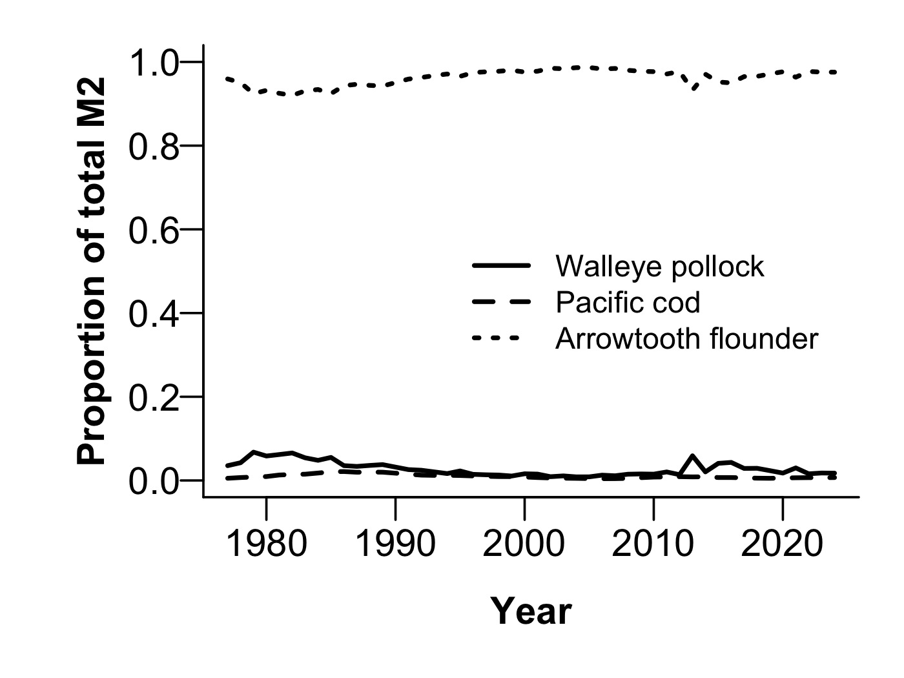

---
output:
  word_document:
    fig_width: 4
    keep_md: yes
  html_document: default
  header-includes:
  - \usepackage{inputenc}
  - \usepackage{unicode-math}
  pdf_document:
    keep_tex: yes
    latex_engine: xelatex
---

## Multispecies model estimates of time-varying natural mortality in the GOA
*Grant Adams$^1$, Kirstin K. Holsman$^{1,2}$, Pete Hulson$^3$, Cole Monnahan$^1$, Kalei Shotwell$^1$*

grant.adams@noaa.gov

$^1$Resource Ecology and Fisheries Management Division, Alaska Fisheries Science Center, Seattle, WA, USA

$^2$School of Aquatic and Fishery Sciences, University of Washington, Seattle, WA, USA

$^3$Auke Bay Laboratories, Alaska Fisheries Science Center, Juneau, AK, USA

$^4$International Pacific Halibut Commission, Seattle, WA, USA.

## Summary statement:

The climate-enhanced multispecies model (CEATTLE) for the Gulf of Alaska (GOA) estimates that natural mortality due to all sources for age-1 pollock and arrowtooth flounder has increased in recent years, but remain below the long-term mean. However, natural mortality for age-1 Pacific cod has decreased slightly since 2023 and remains below the long-term mean. Estimates of biomass consumed of pollock, Pacific cod, and arrowtooth flounder as prey across all ages remains below the long term mean.

## Status and trends:  

Estimated age-1 natural mortality (M) for walleye pollock, Pacific cod, and arrowtooth flounder peaked in 2003 for pollock, 2005 for Pacific cod, and 2001 for arrowtooth flounder (Fig. 1). Average age-1 M estimated by CEATTLE was greatest for pollock (1.5 yr$^{-1}$) and lower for Pacific cod (0.7 yr$^{-1}$) and arrowtooth (0.39 yr$^{-1}$ for females and 0.48 yr$^{-1}$ for males). After varying in recent years, pollock age-1 M increased in 2024 to 1.45 yr$^{-1}$ and is currently below the long-term mean of 1.5 yr$^{-1}$, but above the value used for single species assessment (age-1 M = 1.39; Fig. 1). Pacific cod age-1 M decreased slightly to 0.69 yr$^{-1}$ and remains below the long-term mean of 0.7 yr$^{-1}$ (Fig. 1), but above the age-invariant values estimated in the single species assessment of 0.492 yr$^{-1}$. Similarly, arrowtooth flounder age-1 M remains below the long-term mean after increasing slightly in recent years (Fig. 1). However, arrowtooth age-1 M remains above the values used for the single species assessment of 0.2 yr$^{-1}$ (arrowtooth females) and 0.35 yr$^{-1}$ (arrowtooth males), with total age-1 M at around 0.38 yr$^{-1}$ for arrowtooth females and 0.48 yr$^{-1}$ for arrowtooth males. 2024 age-1 M across species is 4.05% to 32.79% lower than in  peak years.

On average 120,379 mt of age-1 pollock,   2,465 mt of age-1 Pacific cod, and   5,294 mt of age-1 arrowtooth flounder was consumed annually by species included in CEATTLE between 1977 and 2024. For 2024, we estimated 50,726 mt of age-1 pollock,  1,763 mt of age-1 Pacific cod,  4,025 mt of age-1 arrowtooth females, and  1,763 mt of age-1 arrowtooth males was consumed by species included in CEATTLE. Across all ages 394,583 mt of pollock,  25,560 mt of arrowtooth flounder,   4,877 mt of Pacific cod was consumed annually, on average, by species included in CEATTLE. The total biomass consumed of pollock and arrowtooth flounder as prey across all ages increased in 2024 compared to 2023 (Fig. 2). The total biomass consumed of Pacific cod has decreased in recent years. The total biomass consumed as prey across all ages for all species is currently below the long term mean.

## Factors influencing observed trends

Temporal patterns in total natural mortality reflect annually varying changes in predation mortality by pollock, Pacific cod, Pacific halibut, and arrowtooth flounder that primarily impact age-1 fish (but also impact older age classes). Predation mortality at age-1 for all species in the model was primarily driven by arrowtooth flounder (Fig. 3) and arrowtooth flounder biomass has increased in recent years. Combined annual predation demand (annual ration) of age-4+ pollock, Pacific cod, and arrowtooth flounder in 2024 was 5.16 hundred thousand tons, below the 6.17 hundred thousand ton annual average (Fig. 4). 

## Implications: 

We find evidence of increased predation mortality on age-1 pollock, Pacific cod, and arrowtooth flounder due to the species modelled in CEATTLE. Previous ecosystem modelling efforts have estimated that mortality of pollock is primarily driven by Pacific cod (16%), Pacific halibut (23%) and arrowtooth flounder (33%)(Gaichas et al., 2015). Recent increases in predator biomass are contributing to the increase in total consumption and therefore increased predation mortality. Between 1990 and 2010, relatively high natural mortality rates reflect patterns in annual demand for prey from arrowtooth flounder, whose biomass peaked during this time period. 

## Description of index: 

We report trends in age-1 natural mortality for walleye pollock (_Gadus chalcogrammus_), Pacific cod (_Gadus macrocephalus_) and arrowtooth flounder (_Atheresthes stomias_), from the Gulf of Alaska (USA). Total natural mortality rates are based on model estimated sex-specific, time- and age-invariant residual mortality (M1) and model estimates of time- and age-varying predation mortality (M2) produced from the multi-species statistical catch-at-age assessment model (known as CEATTLE; Climate-Enhanced, Age-based model with Temperature-specific Trophic Linkages and Energetics). The model is based, in part, on the parameterization and data used for recent stock assessment models of each species (see Adams et al., 2022 for more detail). The model is fit to data from five fisheries and seven surveys between 1977 and 2024 and includes inputs of abundance-at-age from recent stock assessment models for Pacific halibut scaled to the proportion of age-5+ biomass in IPHC management area 3 (Stewart & Hicks, 2021). Model estimates of predation mortality are empirically derived by bioenergetics-based consumption information and diet data from the GOA to inform predator-prey suitability (Holsman & Aydin, 2015; Holsman, Aydin, Sullivan, Hurst, & Kruse, 2019). 

## Literature Cited
Adams, G. D., Holsman, K. K., Barbeaux, S. J., Dorn, M. W., Ianelli, J. N., Spies, I., Stewart, I. J., et al. 2022. An ensemble approach to understand predation mortality for groundfish in the Gulf of Alaska. Fisheries Research, 251: 106303. 

Holsman, K. K., Ianelli, J., Aydin, K., Punt, A. E., and Moffitt, E. A. 2016. A comparison of fisheries biological reference points estimated from temperature-specific multi-species and single-species climate-enhanced stock assessment models. Deep Sea Research Part II: Topical Studies in Oceanography, 134: 360–378. 

Holsman, KK and K Aydin. (2015). Comparative methods for evaluating climate change impacts on the foraging ecology of Alaskan groundfish. Mar Ecol Prog Ser 521:217-23510.3354/ meps11102

Holsman, K.K., Aydin, K., Sullivan, J., Hurst, T., Kruse, G.H., 2019. Climate effects and bottom-up controls on growth and size-at-age of Pacific halibut (Hippoglossus stenolepis) in Alaska (USA). Fisheries Oceanography, 28: 345–358. doi:10.1111/fog.12416

Gaichas, S., Aydin, K., and Francis, R. C. 2015. Wasp waist or beer belly? Modeling food web structure and energetic control in Alaskan marine ecosystems, with implications for fishing and environmental forcing. Progress in Oceanography, 138: 1–17. Elsevier Ltd. http://dx.doi.org/10.1016/j.pocean.2015.09.010.

Stewart, I., Hicks, A., 2019. Assessment of the Pacific halibut (_Hippoglossus stenolepis_) stock at the end of 2018. International Pacific Halibut Commission. Seattle, Wa, USA.

\newpage 

## Figures: 

{width=80%}

{width=80%}

{width=80%}

{width=80%}

